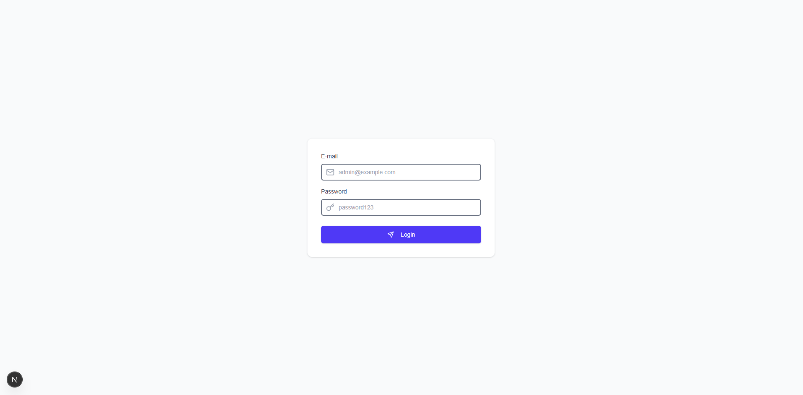

### Admin App

#### Run in development
Start the development server:

```bash
pnpm run dev
```

#### Run with Docker
```bash
docker build -t admin-template-app .

docker run -p 3000:3000 --env-file .env admin-template-app
```
